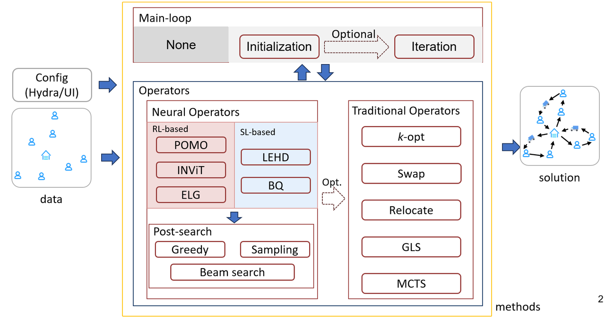

Welcome to EasyNCO's documentation!
======================================

😀欢迎界面

平台大致介绍

pipline:

🚀Features
--------------

- 1
- 2
- 3

🎉Supported methods
----------------------

EasyNCO supports the following methods:

+-----------------+-----------------------------------------------------------------------------------------------------------------------------+
| Methods         | Paper title                                                                                                                 |
+=================+=============================================================================================================================+
| AM              | Attention, Learn To Solve Routing Problems! (ICLR 2019)                                                                     |
+-----------------+-----------------------------------------------------------------------------------------------------------------------------+
| POMO            | POMO: Policy Optimization with Multiple Optima for Reinforcement Learning (NeurIPS 2020)                                    |
+-----------------+-----------------------------------------------------------------------------------------------------------------------------+
| LEHD            | Neural Combinatorial Optimization with Heavy Decoder: Toward Large Scale Generalization (NeurIPS 2023)                      |
+-----------------+-----------------------------------------------------------------------------------------------------------------------------+
| INViT           | INViT: A Generalizable Routing Problem Solver  with Invariant Nested View Transformer (ICML 2024)                           |
+-----------------+-----------------------------------------------------------------------------------------------------------------------------+
| ELG             | Towards Generalizable Neural Solvers for Vehicle Routing Problems via Ensemble with Transferrable Local Policy (IJCAI 2024) |
+-----------------+-----------------------------------------------------------------------------------------------------------------------------+
| DeepACO         | DeepACO: Neural-enhanced Ant Systems for Combinatorial Optimization (NeurIPS 2023)                                          |
+-----------------+-----------------------------------------------------------------------------------------------------------------------------+
| NLNS            | Neural large neighborhood search for routing problems (Artificial Intelligence, 2022)                                       |
+-----------------+-----------------------------------------------------------------------------------------------------------------------------+
|                 | ----                                                                                                                        |
+-----------------+-----------------------------------------------------------------------------------------------------------------------------+
|                 | ----                                                                                                                        |
+-----------------+-----------------------------------------------------------------------------------------------------------------------------+
|                 | ----                                                                                                                        |
+-----------------+-----------------------------------------------------------------------------------------------------------------------------+
|                 | ----                                                                                                                        |
+-----------------+-----------------------------------------------------------------------------------------------------------------------------+

.. note::
    1111

.. tip::
    2222

🌟Supported tasks
-------------------

+----------------------------+----------------------------------------+----------------------------------------------+
| Problem Category           | Typical Problems                       | Description                                  |
+============================+========================================+==============================================+
| Routing Problems           | TSP, ATSP, PCTSP, CVRP, OP, SOP        | Find one or more paths in a graph to minimize|
|                            |                                        | cost or maximize reward under constraints.   |
+----------------------------+----------------------------------------+----------------------------------------------+
| Scheduling Problems        | FFSP, RCPSP, SMTWTP                    | Assign start times or order to tasks under   |
|                            |                                        | resource/time constraints to optimize goals. |
+----------------------------+----------------------------------------+----------------------------------------------+
| Packing Problems           | KP, MKP, BPP                           | Select items under capacity limits to        |
|                            |                                        | maximize value or minimize container usage.  |
+----------------------------+----------------------------------------+----------------------------------------------+
| Assignment / Graph Problems| MIS                                    | Match items or select subsets under structural|
|                            |                                        | constraints to optimize objective.           |
+----------------------------+----------------------------------------+----------------------------------------------+

.. note::
    1111

.. tip::
    2222

🧭Navigation
---------------
.. toctree::
    :maxdepth: 1
    :caption: Getting Started

    getting_started/installation
    getting_started/quickstart
    getting_started/online_demo
    getting_started/gui

.. toctree::
    :maxdepth: 1
    :caption: Overview

    overview/introduction
    overview/platform_structure

.. toctree::
    :maxdepth: 1
    :caption: Developer Documentation

    developer_doc/setting
    developer_doc/data
    developer_doc/exact_solvers
    developer_doc/methods
    developer_doc/phases

.. toctree::
    :maxdepth: 1
    :caption: Method

.. toctree::
    :maxdepth: 1
    :caption: Task

.. toctree::
    :maxdepth: 1
    :caption: About

🤝About EasyNCO
---------------------

📄Citation
-------------------

.. code-block:: bibtex

    @inproceedings{ye2023deepaco,
      title={DeepACO: Neural-enhanced Ant Systems for Combinatorial Optimization},
      author={Ye, Haoran and Wang, Jiarui and Cao, Zhiguang and Liang, Helan and Li, Yong},
      booktitle={Advances in Neural Information Processing Systems},
      year={2023}
    }
